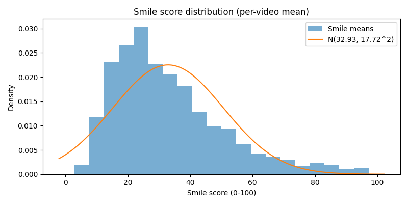

# Feature Statistics Report

Statistics and interpretation guide for **non-verbal interview features** extracted by `vision.py` .

본 문서는 웹캠 기반 면접 분석 스크립트에서 사용되는 **시선/표정/움직임 피처 구조와 통계 기준**을 정리한 것입니다.

## 1. Dataset Overview

현재 스크립트(`vision.py`)는 **실시간 웹캠 분석** 및 **단일 세션 요약**을 수행합니다.  
ko-liwc처럼 하나의 대형 인터뷰 말뭉치에서 모든 통계를 뽑은 것은 아니고, 아래처럼 **출처가 분리**됩니다.

- **Eye contact / Nod**
  - 현재 **전용 데이터셋이 없습니다.**
  - eye contact 비율에 대한 평균/표준편차는 논문(Acarturk et al., 2021; Esmer, 2022)에서 보고된 값을 **규범값(norm)** 으로 차용합니다.
- **Smile (표정)**
  - 약 **1,040개**의 한국어 얼굴 영상 샘플에서 per-video 평균 미소 점수를 수집하여 통계를 계산했습니다.
  - 각 샘플은 **유튜브 클립에서 추출된 “사람 한 명이 카메라 앞에서 말하는 영상”**입니다.
  - 이 데이터는 **실제 면접 장면이 아니므로, 면접 맥락에 그대로 일반화하기에는 한계**가 있음을 명시합니다.

> ⚠️ 정리:  
> - eye contact / nod: **문헌 기반 규범값만 존재, 자체 데이터셋 분포는 아직 없음**  
> - smile: **약 1,040개의 유튜브 1인 화자 영상에서 추출한 분포이며, 면접 상황과는 다른 도메인**이므로 해석에 주의 필요


## 2. Target Session Features

현 버전 스크립트에서 **세션 요약에 실제로 출력되는 핵심 피처**는 다음과 같습니다.

| Feature Name        | Description                                        | Level   | Notes                                   |
|---------------------|----------------------------------------------------|---------|-----------------------------------------|
| `eye_contact_ratio` | 얼굴이 검출된 프레임 중 아이컨택으로 판정된 비율 (0~1) | session | mean/std는 외부 논문 통계를 사용        |
| `z_eye`             | `eye_contact_ratio`의 Z-Score                     | session | μ=0.70, σ=0.15 기준                     |
| `avg_smile_0_100`   | 평균 미소 강도 (0~100, Duchenne smile 기반)       | session | 약 1,040개 유튜브 영상 기반 통계        |
| `nod_count`         | 끄덕임 횟수                                        | session | 아직 대규모 통계 없음 (TBD)            |


## 3. Smile Statistics

### 3.1 Dataset

- 샘플 수: **약 1,040개 영상**
- 출처: **유튜브 클립**
- 내용: **각 영상마다 사람 한 명이 카메라 앞에서 말하는 장면**
- 참고: 면접 상황이 아닌 **일반 화자 영상**이므로,
  - “면접에서의 자연스러운 미소 수준”이라기보다는  
  - “유튜브 1인 화자 영상 환경에서의 평균적인 미소 강도”에 가깝습니다.

### 3.2 Distribution

아래는 per-video 평균 미소 점수(`avg_smile_0_100`)의 분포입니다.  
(0~100 스케일, Duchenne smile 기반 스코어)



- 파란 히스토그램: 각 영상의 평균 미소 점수 분포
- 주황 곡선: 정규분포 근사 `N(32.93, 17.72^2)`

### 3.3 Summary Statistics

위 데이터셋에서 얻은 통계는 다음과 같습니다.

| Metric | Value          |
|--------|----------------|
| N      | ≈ 1,040 videos |
| Mean   | **32.93 / 100**|
| Std    | **17.72**      |

> ⚠️ 이 데이터셋은 **실제 면접 장면이 아니므로**,  
> 본 리포트의 Smile 통계는  
> - “초기 기준(initial norm)” 혹은  
> - “타 도메인(유튜브 1인 화자)의 평균 미소 수준”으로 해석하는 것이 안전합니다.  
> 실제 면접 데이터셋이 확보되면, 이 값을 대체하거나 보정하는 것이 권장됩니다.

### 3.4 Z-Score Thresholds for Smile

위 평균/표준편차를 기준으로, z-score와 값의 대응 관계는 다음과 같습니다.

| Z-Score | Smile Score (0~100) | Interpretation (비공식 가이드)      |
|---------|----------------------|-------------------------------------|
| z ≈ -2  | ~ 0 (clip from -2.51)| 매우 무표정 / 거의 웃지 않음        |
| z ≈ -1  | ≈ 15.21              | 평균보다 확실히 적게 웃음           |
| z ≈ 0   | ≈ 32.93              | 평균적인 수준의 미소                |
| z ≈ +1  | ≈ 50.65              | 평균보다 자주 / 크게 웃음           |
| z ≈ +2  | ≈ 68.37              | 매우 자주 / 크게 웃음               |

z-score 공식은 다음과 같습니다.

```text
z_smile = (avg_smile_0_100 - 32.93) / 17.72
```

현재 코드에는 이 값을 바로 사용하지 않고,  
추후 면접 데이터셋이 확보되면 **새로운 규범값으로 교체하거나 보정용 참고값**으로 활용할 수 있습니다.


## 4. Normalization & Future Work

### 4.1 현재 구현된 정규화

- **Eye-contact Ratio**
  - Z-Score: `z_eye = (eye_ratio - 0.70) / 0.15`

- **Smile**
  - 위에서 제시한 평균/표준편차(32.93, 17.72)를 사용하면,
  - 필요할 때 `z_smile = (avg_smile_0_100 - 32.93) / 17.72` 형태로 동일한 z-score 정규화를 적용할 수 있습니다.
  - 다만, 이 값은 **면접 맥락이 아닌 유튜브 1인 화자 데이터셋**에 기반하므로 “임시 기준”으로 간주하는 것이 안전합니다.

### 4.2 추후 확장 시 권장 사항

1. **면접 전용 데이터셋 구축**
   - 실제 모의/실제 면접 영상을 여러 세션 수집
   - `eye_contact_ratio`, `avg_smile_0_100`, `nod_count` 등을 로깅
   - 이 데이터셋에서 정식 Mean/Std/Percentile 계산


## 5. References

- Acarturk, C. et al. (2021). *Gaze Aversion in Conversational Settings: An Investigation Based on Mock Job Interview.*  
- Esmer, B. (2022). *An Experimental Investigation of Gaze Behavior Modeling in VR.* MSc Thesis.  
- Ye, X. et al. *Low-cost Geometry-based Eye Gaze Detection using Facial Landmarks Generated through Deep Learning.*  
- Naim, I, Tanveer, M. I., Gildea, D., & Hoque, M. E. (2018). *Automated Analysis and Prediction of Job Interview Performance.* IEEE Transactions on Affective Computing.
